# Begeleidende Verantwoording – Cloud Computing

## Inleiding

In dit verslag verantwoord ik mijn werkzaamheden binnen het vak **Cloud Computing**, onderdeel van de **HBO-ICT** module **Operations Engineering**. De nadruk ligt op het inrichten, beheren en monitoren van een Proxmox-cluster inclusief geautomatiseerde uitrol van webapplicaties.

## Opdrachten van het project

De werkzaamheden van de project:
- De Cloud omgeving online opzetten: Voorbereidende opdracht.
- Cloudopdracht 1, klant 1
- Cloudopdracht 1, klant 2

## Verantwoording voorbereidende opdracht

Vanuit de opleiding zijn 3 virtuele servers toegewezen die fungeren als simulatie van fysieke servers.  
Doel was het installeren van Proxmox, het opzetten van een cluster, en het realiseren van gedeelde opslag via Ceph.  

De volgende stappen zijn uitgevoerd:  

| Stap | Beschrijving                                              |
|------|-----------------------------------------------------------|
| 1    | Proxmox geïnstalleerd op 3 VM’s (elk met eigen naam + IP) |
| 2    | Pakketten geüpdatet + juiste repositories ingesteld       |
| 3    | Cluster aangemaakt met `pvecm`                            |
| 4    | Ceph geïnstalleerd voor gedeelde opslag (shared storage)  |
| 5    | Cluster gereed voor verdere opdrachten                    |


### Proxmox netwerk instellingen

|nodenaam|IP intern    |Type node    |IP Tailscale  |
|--------|-------------|-------------|--------------|
|pve00   |10.24.13.100 |control node |100.94.185.45 |
|pve01   |10.24.13.101 |managed node |100.104.126.78|
|pve02   |10.24.13.102 |managed node |100.84.145.8  |

---

### Partitie instellingen per node


|Partitie |	Grootte |	Beschrijving                       |
|---------|---------|--------------------------------------|
|/dev/sda1|	1 MB	|BIOS boot (voor het opstarten)        |
|/dev/sda2|	1 GB	|EFI (voor UEFI boot systemen)         |
|/dev/sda3|	106 GB	|LVM – hierop is Proxmox geïnstalleerd |
|/dev/sda4|	215 GB	|Voor Ceph OSD gebruikt                |

Hierbij een screenshot van de ingestelde partities:

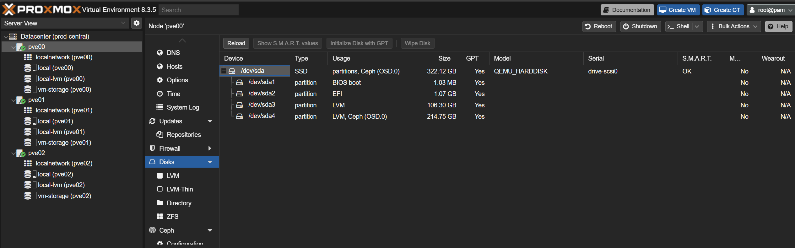

---

### SSH Certificaat

Om er voor te zorgen dat het mogelijk is meerdere nodes te beheren vanuit een control node, Is het de bedoeling om te kunnen inloggen zonder wachtwoord.  
Daarvoor in de plaats wordt er ingelogd met certificaten en sleutels.

Stap 1: Remote Laptop met certificaat via root koppelen aan control unit:  
```bash
ssh-keygen
ssh-copy-id root@100.94.185.45
```

Stap 2: Control unit met certificaat via beheerder koppelen aan managed units:  
```bash
adduser bob # (op alle nodes)
usermod -aG sudo bob # om beheerder te maken, dit op alle nodes. Later via playbook automatisch.
ssh-keygen -t rsa -b 4096 -f ~/.ssh/id_rsa_bob # Op de control node. Hier komt de private key en de te verdelen public key.
ssh-copy-id bob@10.24.13.101 # Kopieren van public key naar andere servers
ssh-copy-id bob@10.24.13.102 # Kopieren van public key naar andere servers
```


### Ansible playbooks (orchestration)

Op node pve00 is Ansible geïnstalleerd als **control node**. De nodes pve01 en pve02 fungeren als **managed nodes**.

Hiervoor zijn playbooks geschreven.
De playbooks bevinden zich in de map `/Playbooks/ansible-ubuntu/`

- `initial.yml` – eenmalige setup van gebruikers en SSH
- `ongoing.yml` – voor updates en onderhoudstaken  

> Met `initial.yml` wordt root op de managed units uitgeschakeld! Vanaf nu kan alleen nog maar worden ingelogd met de beheerder account!  

In de map `/vars/` is `default.yml` aanwezig met de volgende variabelen:

```yaml
create_user: beheerder
ssh_port: 6123
copy_local_key: "{{ lookup('file', lookup('env','HOME') + '/.ssh/id_rsa.pub') }}"
```

> Hiermee wordt de gebruiker `beheerder` met sudo-rechten aangemaakt op alle nodes, wordt poort 6123 gebruikt voor SSH en wordt authenticatie geregeld via sleutels (geen wachtwoorden).


#### Updates via Ansible

Updates worden uitgevoerd met het playbook `ongoing.yml`:

```bash
ansible-playbook --ask-vault-pass ongoing.yml
```

Hiermee zijn updates geautomatiseerd uitgevoerd op alle nodes – een concrete invulling van "updates via orchestration".

Resultaat:
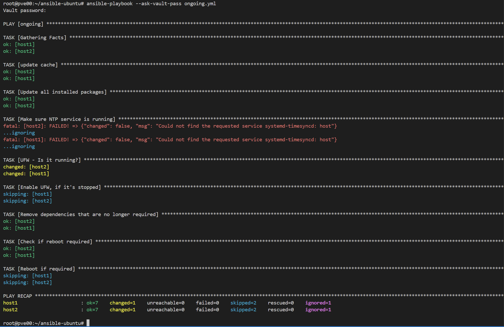

---

### 6. Ceph & High Availability

Ceph is op alle nodes geïnstalleerd voor gedeelde, fouttolerante opslag. Hierdoor ondersteunt het Proxmox-cluster **High Availability (HA)**:

> Bij uitval van een node worden virtuele machines automatisch opnieuw opgestart op een andere node.  
> De data blijft beschikbaar dankzij Ceph-replicatie over meerdere nodes.

Hierbij een screenshot van het monitoren:

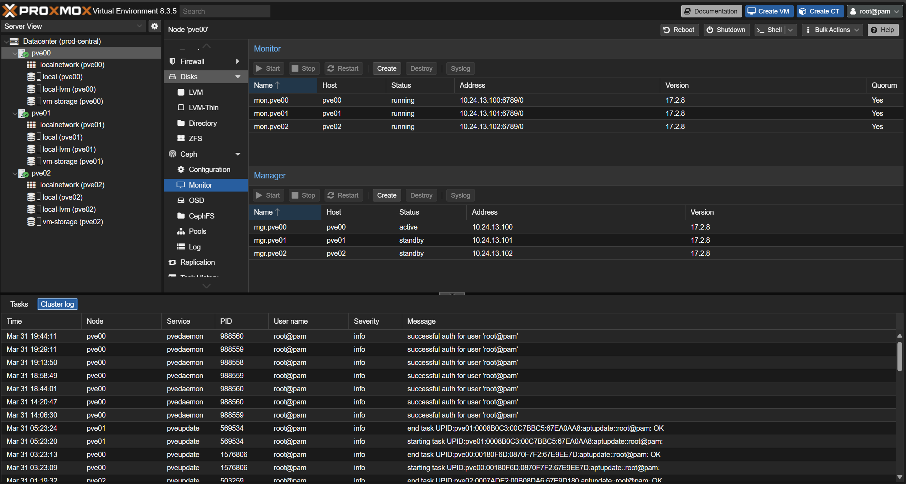

---

### 7. Status

Op dit moment is het cluster volledig operationeel, voorzien van:
- Proxmox-cluster met 3 nodes
- Geconfigureerde shared storage via Ceph
- Werkende HA-configuratie
- Updates en beheer via Ansible


## Verantwoording Opdracht 1: Klant 1

### Opdracht:
**Klant 1: WordPress voor trainingsdoeleinden**  
De eerste klant wil verschillende WordPress-websites afnemen voor trainingsdoeleinden.
De focus ligt op het zo goedkoop mogelijk aanbieden van deze websites.
Hierop is de klant aangeboden dat de applicaties in container (LXC) wordt aangeboden.

### Fase 1, Rechtstreeks met CLI en Bash een container maken:

#### stap 1: download de container template (LXC)
Een LXC container wordt niet opgebouwd vanuit een ISO zoals een VM, maar vanuit een root filesystem (.tar.zst). 

```bash
root@pve00:~# pveam update && pveam available
root@pve00:~# pveam available | grep ubuntu-22.04
system          ubuntu-22.04-standard_22.04-1_amd64.tar.zst
root@pve00:~# pveam download local ubuntu-22.04-standard_22.04-1_amd64.tar.zst
```

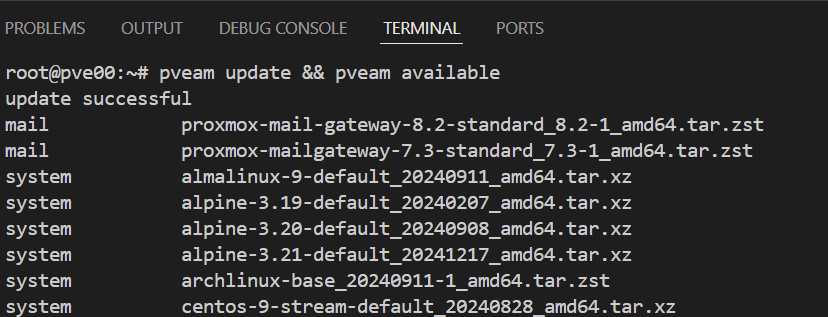

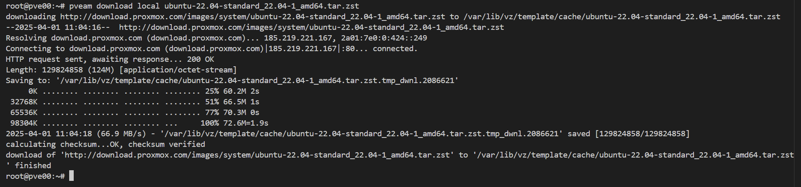

#### Stap 2: Maak een enkele container aan.

De container heeft volgens de beoordelingsmatrix de volgende eisen:

| Eigenschap       | Waarde                        |
|------------------|-------------------------------|
| CPU              | 1 core                        |
| RAM              | 1024 MB (1 GB)                |
| Disk             | 30 GB                         |
| Network limit    | 50 MB/s                       |
| Poorten open     | 80 (HTTP), 443 (HTTPS)        |
| Firewall         | Alleen toegang tot webdiensten|

Hierbij de gebruikte Bash code om dit aan te maken,  
dit is gedaan vanuit control unit pve00 met ssh naar managed unit pve01:

```bash
root@pve00:~# ssh -p 6123 beheerder@pve01 'sudo pct create 101 local:vztmpl/ubuntu-22.04-standard_22.04-1_amd64.tar.zst \
  --hostname wp1 \
  --cores 1 \
  --memory 1024 \
  --rootfs local-lvm:30 \
  --net0 name=eth0,bridge=vmbr0,rate=50 \
  --ostype ubuntu \
  --password wordpress \
  --unprivileged 1'
```

Screenshot:

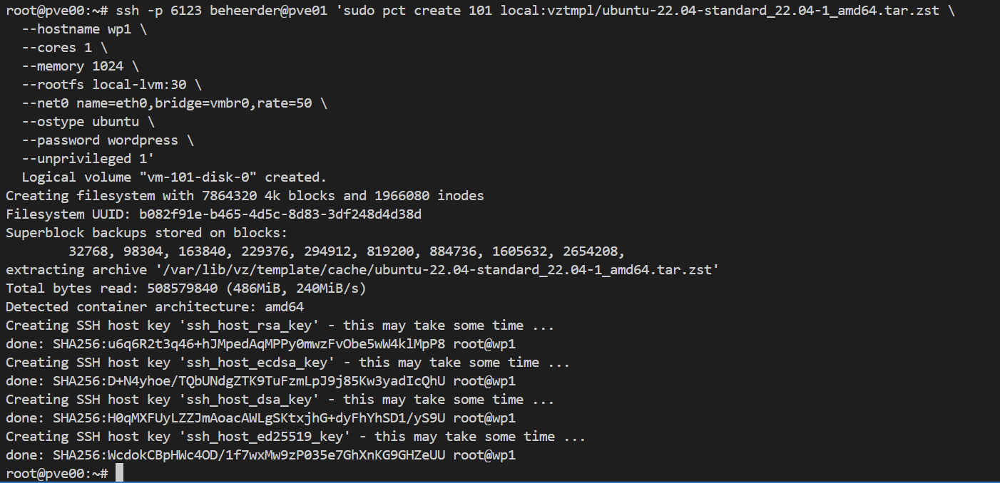

### Stap 3: Firewall instellen

Op de managed nodes is de firewall voor container CT 101 ingesteld:

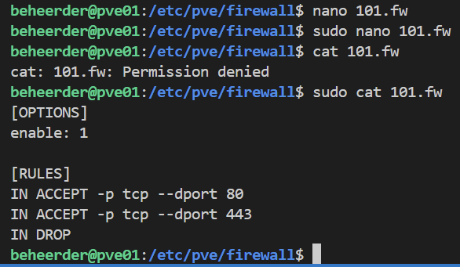

### Stap 4: Testen of het werkt

Hierbij start de container:

```bash
beheerder@pve01:~$ sudo pct start 101
beheerder@pve01:~$ sudo pct exec 101 -- bash
root@wp1:/# 
```

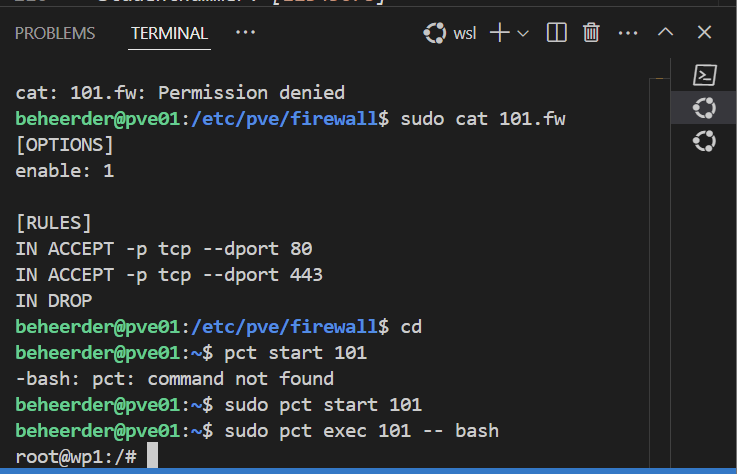

### Stap 5: Wordpress installeren

Op de container moet nu de applicatie Wordpress geinstalleerd worden.
Daarbij kwam het probleem dat het niet mogelijk was om online te komen met sudo apt update.
Er waren 2 fouten.
De tailgate DNS 100.100.100.100 werd gebruikt -> die is omgezet naar 1.1.1.1
net0 was verkeerd ingesteld.

```conf
arch: amd64
cores: 1
hostname: wp1
memory: 1024
net0: name=eth0,bridge=vmbr0,ip=10.24.13.101/24,gw=10.24.13.1,rate=50
ostype: ubuntu
rootfs: local-lvm:vm-101-disk-0,size=30G
swap: 512
unprivileged: 1
```

#### Installatie stappen: 

1) update en upgrade

```bash
sudo apt update
sudo apt upgrade -y
```

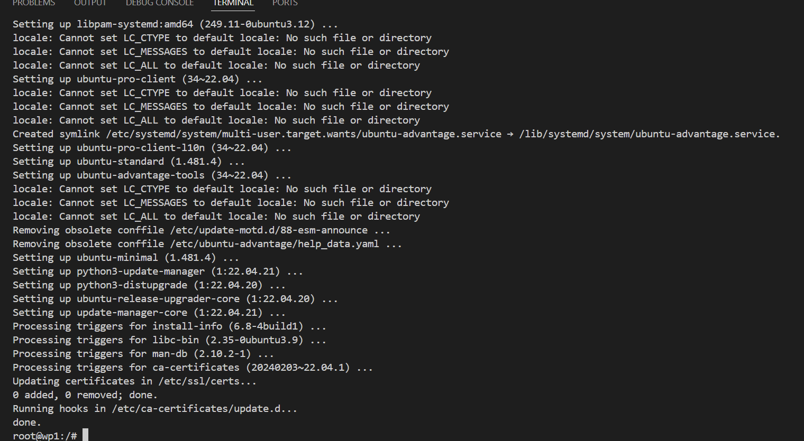

2) Installeren van Apache, PHP en MariaDB:  

```bash
apt install apache2 mariadb-server php php-mysql libapache2-mod-php php-cli php-curl php-gd php-xml php-mbstring unzip wget -y
```

Apache test:
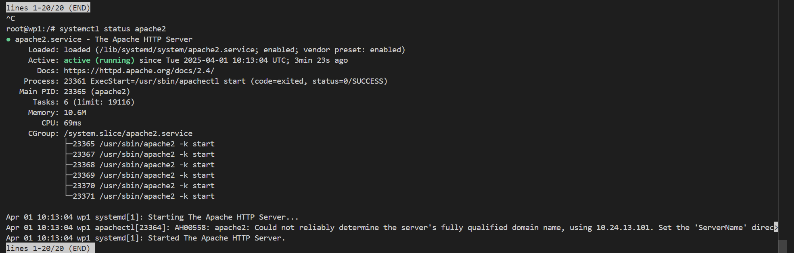

3) MariaDB aanmaken:

```bash
mysql_secure_installation
mysql -u root
```

```sql
CREATE DATABASE wordpress;
CREATE USER 'wpuser'@'localhost' IDENTIFIED BY 'wppass';
GRANT ALL PRIVILEGES ON wordpress.* TO 'wpuser'@'localhost';
FLUSH PRIVILEGES;
EXIT;
```

Aanmaken Database:
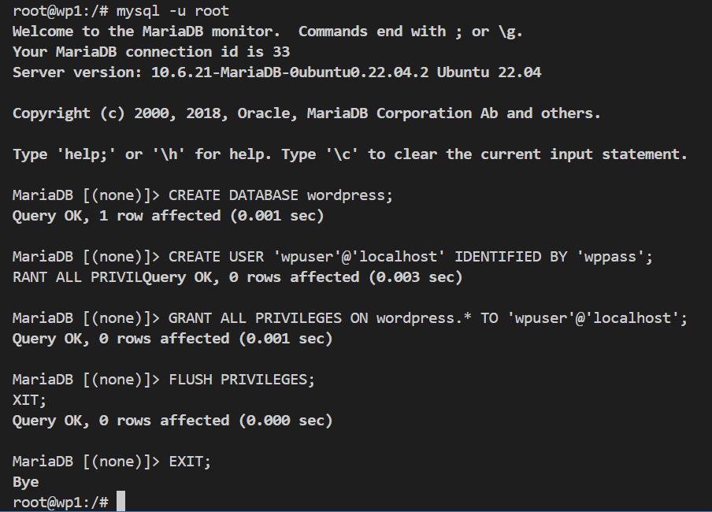

Controleren of databse en user ingesteld zijn (database wordpress, user wpuser):
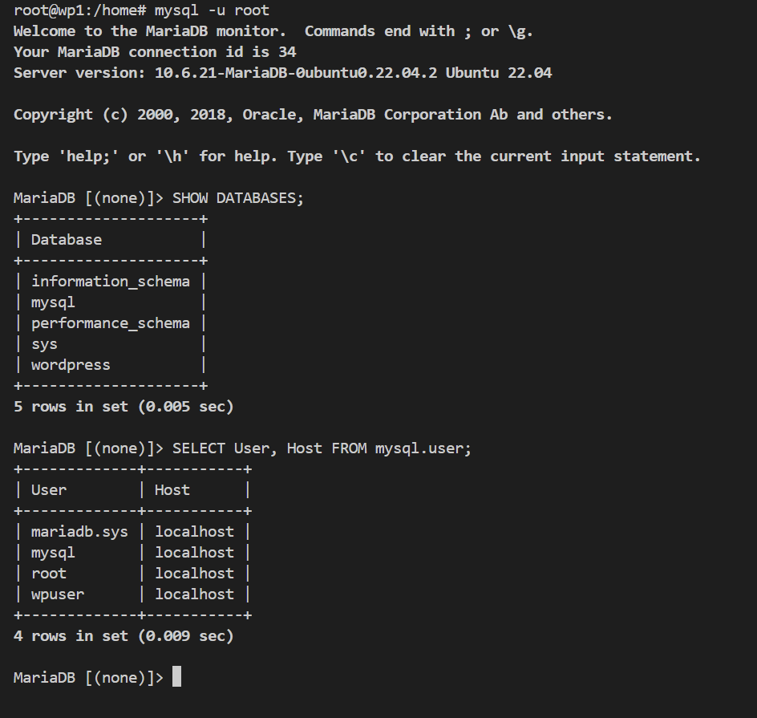


4) Wordpress installeren

In de container CLI:
```bash
cd /tmp
echo "nameserver 1.1.1.1" > /etc/resolv.conf

# Dit moet op de host! niet de container
wget https://wordpress.org/latest.tar.gz
sudo pct push 101 latest.tar.gz /tmp/latest.tar.gz # pushen naar container.

# Dan in de container:
tar -xvzf latest.tar.gz
sudo mv wordpress /var/www/html/wordpress
sudo chown -R www-data:www-data /var/www/html/wordpress
sudo chmod -R 755 /var/www/html/wordpress

# Apache configureren
sudo nano /etc/apache2/sites-available/wordpress.conf
sudo a2ensite wordpress.conf
sudo a2enmod rewrite
sudo systemctl reload apache2
```

De website heeft een ping, en geeft een standaard website als response.
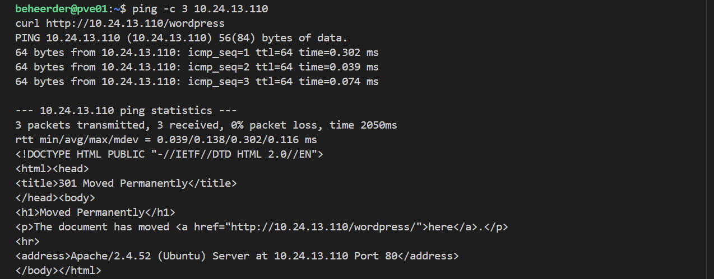

#### Firewall instellen

```bash
beheerder@pve01:~$ echo $CTID
111
beheerder@pve01:~$ sudo pct exec $CTID -- bash -c "ufw default deny incoming"
Default incoming policy changed to 'deny'
(be sure to update your rules accordingly)
beheerder@pve01:~$ sudo pct exec $CTID -- bash -c "ufw allow 80/tcp comment 'Allow HTTP'"
Rules updated
Rules updated (v6)
beheerder@pve01:~$ sudo pct exec $CTID -- bash -c "ufw allow 443/tcp comment 'Allow HTTPS'"
Rules updated
Rules updated (v6)
beheerder@pve01:~$ sudo pct exec $CTID -- bash -c "ufw allow out to any"
Rules updated
Rules updated (v6)
beheerder@pve01:~$ sudo pct exec $CTID -- bash -c "yes | ufw enable"
Firewall is active and enabled on system startup
yes: standard output: Broken pipe
beheerder@pve01:~$ 
```

#### User aanmaken

```bash
beheerder@pve01:~$ USERNAME="wpadmin"
PUBKEY_PATH="/root/.ssh/id_rsa.pub"
beheerder@pve01:~$ echo "🔑 Gebruiker '$USERNAME' aanmaken en SSH key toevoegen aan container $CTID"
🔑 Gebruiker 'wpadmin' aanmaken en SSH key toevoegen aan container 111
beheerder@pve01:~$ sudo pct exec $CTID -- bash -c "adduser --disabled-password --gecos '' $USERNAME"
perl: warning: Setting locale failed.
perl: warning: Please check that your locale settings:
        LANGUAGE = (unset),
        LC_ALL = (unset),
        LANG = "en_US.UTF-8"
    are supported and installed on your system.
perl: warning: Falling back to the standard locale ("C").
Adding user `wpadmin' ...
Adding new group `wpadmin' (1000) ...
Adding new user `wpadmin' (1000) with group `wpadmin' ...
Creating home directory `/home/wpadmin' ...
Copying files from `/etc/skel' ...
beheerder@pve01:~$ sudo pct exec $CTID -- bash -c "mkdir -p /home/$USERNAME/.ssh"
beheerder@pve01:~$ sudo pct exec $CTID -- bash -c \"echo '$(cat $PUBKEY_PATH)' > /home/$USERNAME/.ssh/authorized_keys\"
-bash: /home/wpadmin/.ssh/authorized_keys": No such file or directory
beheerder@pve01:~$ # 1. Maak gebruiker aan
sudo pct exec $CTID -- adduser --disabled-password --gecos "" $USERNAME
perl: warning: Setting locale failed.
perl: warning: Please check that your locale settings:
        LANGUAGE = (unset),
        LC_ALL = (unset),
        LANG = "en_US.UTF-8"
    are supported and installed on your system.
perl: warning: Falling back to the standard locale ("C").
adduser: The user `wpadmin' already exists.
beheerder@pve01:~$ # 2. Maak .ssh dir aan
sudo pct exec $CTID -- mkdir -p /home/$USERNAME/.ssh
beheerder@pve01:~$ # 3. Push public key vanaf host naar container
sudo pct push $CTID $PUBKEY_PATH /home/$USERNAME/.ssh/authorized_keys
beheerder@pve01:~$ # 4. Zet juiste permissies
sudo pct exec $CTID -- chown -R $USERNAME:$USERNAME /home/$USERNAME/.ssh
sudo pct exec $CTID -- chmod 700 /home/$USERNAME/.ssh
sudo pct exec $CTID -- chmod 600 /home/$USERNAME/.ssh/authorized_keys
```

#### Uitval server

Op 1 april 2025 was OSD.1 op node pve01 tijdelijk uitgevallen (autoout). Hierdoor gaf Ceph de status HEALTH_WARN. De fout werd veroorzaakt doordat de OSD zichzelf had uitgeschakeld na het verliezen van netwerkbinding (set_numa_affinity unable to identify public interface).
Na het uitvoeren van systemctl start ceph-osd@1 is de OSD weer gestart en toont het cluster nu de status HEALTH_OK.
Hiermee is aangetoond dat de fouttolerantie van Ceph correct werkt en dat het cluster zichzelf herstelt zodra een OSD weer beschikbaar is.


### Fase 2, CLI commando's omzetten naar Bash-script voor automatisch aanmaken container:

Alle bovenstaande commando's zijn samengevoegd in een script.  
Dit is meermaals doorlopen om volledig te testen dat alles werkt.
In de git history is het meermaals aangepast.

Versie voor maken van container met een parameter, Let op die parameter is een IP en moet anders zijn dan een reeds gebruikte IP!:
```bash
#!/bin/bash

# === Instellingen ===
CTID=$1                       # Bijv. 111
HOSTNAME="wp${CTID}"
IP="10.24.13.${CTID}"
GW="10.24.13.1"
TEMPLATE="local:vztmpl/ubuntu-22.04-standard_22.04-1_amd64.tar.zst"
STORAGE="local-lvm"
USERNAME="wpadmin"
PUBKEY_PATH="/home/beheerder/.ssh/id_rsa.pub" 

echo "📦 Container $CTID aanmaken op IP $IP"

# === 1. Container aanmaken ===
sudo pct create $CTID $TEMPLATE \
  --hostname $HOSTNAME \
  --cores 1 \
  --memory 1024 \
  --swap 512 \
  --net0 name=eth0,bridge=vmbr0,ip=${IP}/24,gw=$GW,rate=50 \
  --rootfs ${STORAGE}:30 \
  --ostype ubuntu \
  --unprivileged 1

# === 2. Container starten ===
sudo pct start $CTID
sleep 5

# === 3. DNS fix voor Tailgate (resolv.conf workaround) ===
echo "nameserver 1.1.1.1" | sudo tee /etc/resolv.custom.conf > /dev/null
sudo pct exec $CTID -- bash -c "echo 'nameserver 1.1.1.1' > /etc/resolv.conf"

# === 4. Software installeren ===
sudo pct exec $CTID -- bash -c "apt update && apt upgrade -y"
sudo pct exec $CTID -- bash -c "apt install -y apache2 mariadb-server php php-mysql libapache2-mod-php php-cli php-curl php-gd php-xml php-mbstring unzip wget"

# === 4.1 SSH-server installeren ===
sudo pct exec $CTID -- bash -c "apt install -y openssh-server"
sudo pct exec $CTID -- bash -c "systemctl enable ssh && systemctl start ssh"


# === 4.5 Firewall instellen ===
echo "🛡️  Firewall (UFW) instellen op container $CTID"
sudo pct exec $CTID -- bash -c "apt install -y ufw"
sudo pct exec $CTID -- bash -c "ufw default deny incoming"
sudo pct exec $CTID -- bash -c "ufw allow 22/tcp comment 'Allow SSH'"
sudo pct exec $CTID -- bash -c "ufw allow 80/tcp comment 'Allow HTTP'"
sudo pct exec $CTID -- bash -c "ufw allow 443/tcp comment 'Allow HTTPS'"
sudo pct exec $CTID -- bash -c "ufw allow out to any"
sudo pct exec $CTID -- bash -c "yes | ufw enable"

# === 4.6 SSH gebruiker + key instellen ===
echo "🔑 Gebruiker '$USERNAME' aanmaken en SSH key toevoegen aan container $CTID"

sudo pct exec $CTID -- adduser --disabled-password --gecos "" $USERNAME
sudo pct exec $CTID -- mkdir -p /home/$USERNAME/.ssh
sudo bash -c "cat $PUBKEY_PATH | pct exec $CTID -- tee /home/$USERNAME/.ssh/authorized_keys > /dev/null"
sudo pct exec $CTID -- chown -R $USERNAME:$USERNAME /home/$USERNAME/.ssh
sudo pct exec $CTID -- chmod 700 /home/$USERNAME/.ssh
sudo pct exec $CTID -- chmod 600 /home/$USERNAME/.ssh/authorized_keys

# ✅ SSH configuratie forceren
sudo pct exec $CTID -- sed -i 's/^#*PubkeyAuthentication.*/PubkeyAuthentication yes/' /etc/ssh/sshd_config
sudo pct exec $CTID -- sed -i 's/^#*AuthorizedKeysFile.*/AuthorizedKeysFile .ssh\/authorized_keys/' /etc/ssh/sshd_config
sudo pct exec $CTID -- systemctl restart ssh


# === 5. MariaDB configureren ===
sudo pct exec $CTID -- bash -c "mysql -u root <<EOF
CREATE DATABASE wordpress;
CREATE USER 'wpuser'@'localhost' IDENTIFIED BY 'wppass';
GRANT ALL PRIVILEGES ON wordpress.* TO 'wpuser'@'localhost';
FLUSH PRIVILEGES;
EOF"

# === 6. WordPress downloaden en installeren ===
sudo pct exec $CTID -- bash -c "cd /tmp && wget https://wordpress.org/latest.tar.gz"
sudo pct exec $CTID -- bash -c "cd /tmp && tar -xvzf latest.tar.gz"
sudo pct exec $CTID -- bash -c "mv /tmp/wordpress /var/www/html/wordpress"
sudo pct exec $CTID -- bash -c "chown -R www-data:www-data /var/www/html/wordpress && chmod -R 755 /var/www/html/wordpress"

# === 7. Apache config aanmaken ===
sudo pct exec $CTID -- bash -c "cat > /etc/apache2/sites-available/wordpress.conf <<EOL
<VirtualHost *:80>
    ServerAdmin admin@localhost
    DocumentRoot /var/www/html/wordpress
    ServerName ${HOSTNAME}.local

    <Directory /var/www/html/wordpress>
        AllowOverride All
        Require all granted
    </Directory>

    ErrorLog \${APACHE_LOG_DIR}/error.log
    CustomLog \${APACHE_LOG_DIR}/access.log combined
</VirtualHost>
EOL"

# === 8. Apache activeren ===
sudo pct exec $CTID -- bash -c "a2ensite wordpress.conf && a2enmod rewrite && systemctl reload apache2"

# === 9. Curl test ===
echo " Curl test vanaf host naar http://${IP}/wordpress"
curl -s -o /dev/null -w "📡 HTTP status: %{http_code}\n" http://${IP}/wordpress # Dit moet 200 of 301 zijn.

echo "✅ Container $CTID klaar! Bezoek: http://${IP}/wordpress"
```

### Wordpress werkend in browser via tailscale

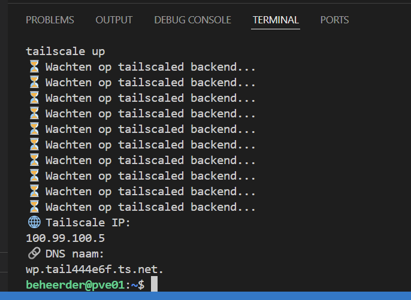

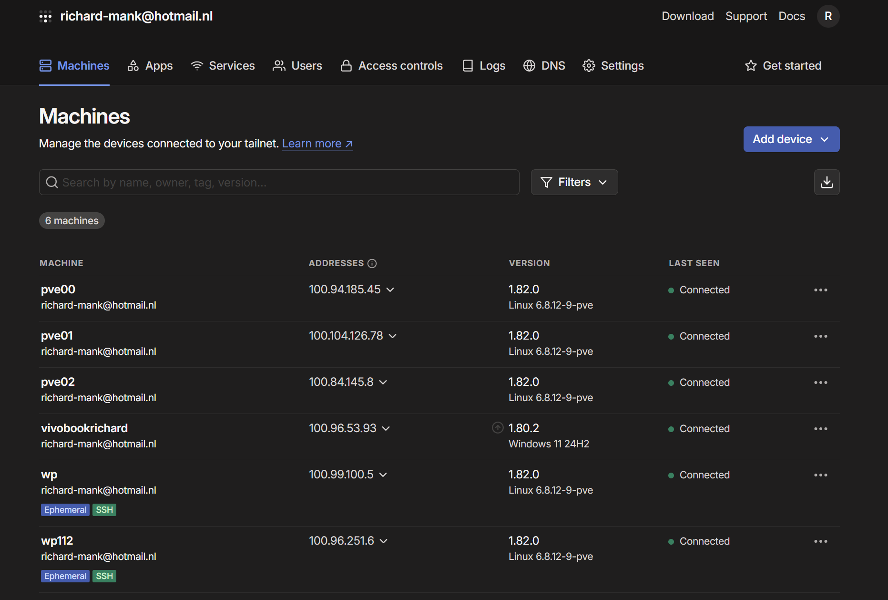

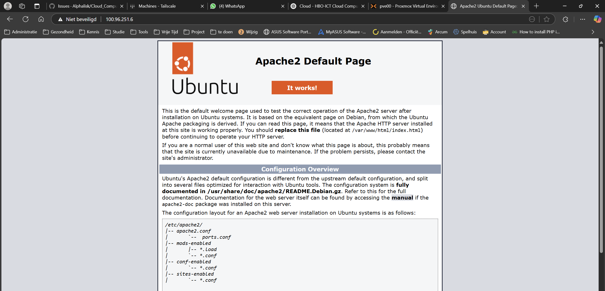

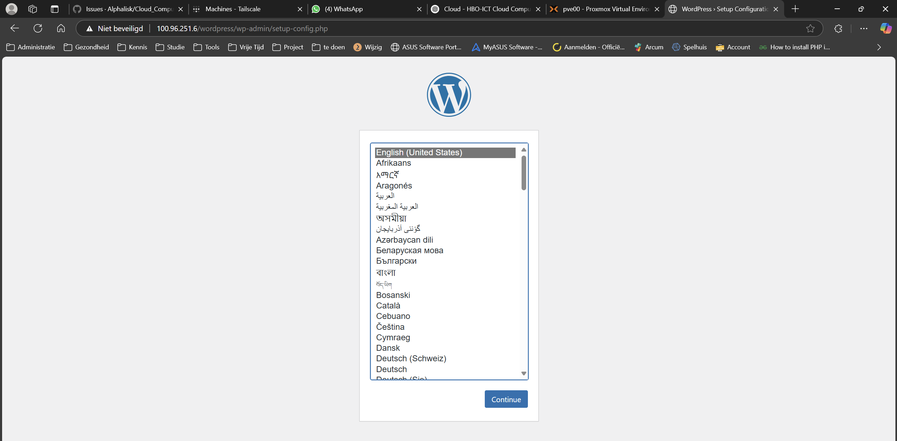

### 6 containers gemaakt voor de klant

Het script is zes keer uitgevoerd en er zijn nu 6 containers beschikbaar voor de klant.  
Deze containers voldoen aan de gestelde eisen:

| Eigenschap       | Waarde                        |
|------------------|-------------------------------|
| CPU              | 1 core                        |
| RAM              | 1024 MB (1 GB)                |
| Disk             | 30 GB                         |
| Network limit    | 50 MB/s                       |
| Poorten open     | 80 (HTTP), 443 (HTTPS)        |
| Firewall         | Alleen toegang tot webdiensten|

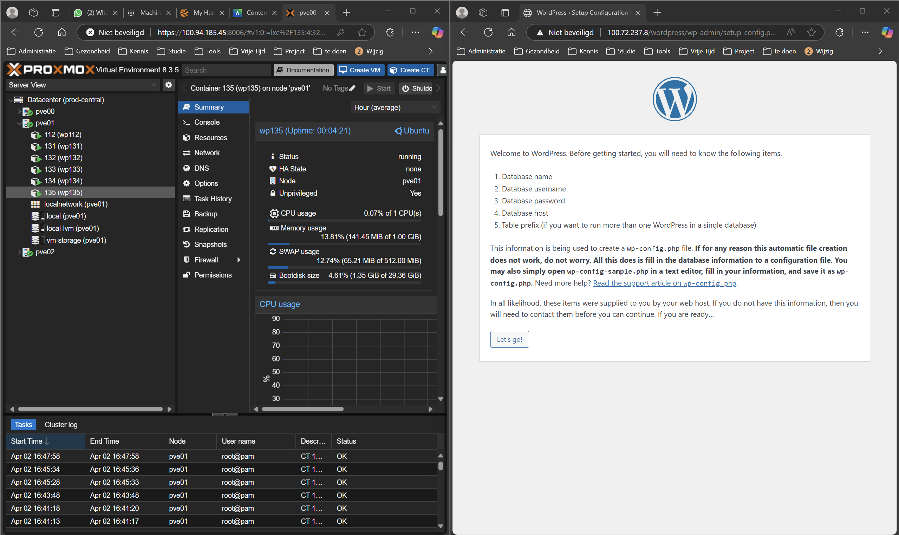

### Monitoring

Allereerst handmatig op een container proberen netstat te regelen.

```bash
echo "📈 Netdata installeren op container $CTID"
sudo pct exec $CTID -- bash -c "apt install -y curl sudo"

# Installatie via Netdata kickstart script
sudo pct exec $CTID -- bash -c "bash <(curl -SsL https://my-netdata.io/kickstart-static64.sh)"

# UFW-poort openen
sudo pct exec $CTID -- ufw allow 19999/tcp comment 'Allow Netdata web interface'
```

Daarna controleren of het werkt.

```bash
beheerder@pve01:~$ sudo pct exec $CTID -- systemctl status netdata --no-pager
● netdata.service - Netdata, X-Ray Vision for your infrastructure!
     Loaded: loaded (/lib/systemd/system/netdata.service; enabled; vendor preset: enabled)
     Active: active (running) since Wed 2025-04-02 19:24:23 UTC; 1min 3s ago
    Process: 26490 ExecStartPre=/bin/mkdir -p /var/cache/netdata (code=exited, status=0/SUCCESS)
    Process: 26492 ExecStartPre=/bin/chown -R netdata /var/cache/netdata (code=exited, status=0/SUCCESS)
   Main PID: 26493 (netdata)
      Tasks: 92 (limit: 19116)
     Memory: 119.8M
        CPU: 3.457s
     CGroup: /system.slice/netdata.service
             ├─26493 /usr/sbin/netdata -P /run/netdata/netdata.pid -D
             ├─26596 "spawn-plugins    " "  " "                        " "  "
             ├─26822 bash /usr/libexec/netdata/plugins.d/tc-qos-helper.sh 1
             ├─26823 /usr/libexec/netdata/plugins.d/systemd-journal.plugin 1
             ├─26830 /usr/libexec/netdata/plugins.d/go.d.plugin 1
             ├─26831 /usr/libexec/netdata/plugins.d/network-viewer.plugin 1
             ├─26840 /usr/libexec/netdata/plugins.d/nfacct.plugin 1
             ├─26849 /usr/libexec/netdata/plugins.d/apps.plugin 1
             └─26852 "spawn-setns                                         " " "

Apr 02 19:24:32 wp135 netdata[26493]: Dimension metadata check has been scheduled to run (max id = 2237)
Apr 02 19:24:32 wp135 netdata[26493]: Chart metadata check has been scheduled to run (max id = 1064)
Apr 02 19:24:32 wp135 netdata[26493]: Chart label metadata check has been scheduled to run (max id = 4305)
Apr 02 19:24:37 wp135 netdata[26493]: ALERT 'system_post_update_reboot_status' of 'system.post_update_reboot_status' on node 'wp1…o WARNING.
                                      ⚠️ System requires reboot after package updates on wp135.
                                      wp135:system.post_update_reboot_status:system_post_update_reboot_status value got from nan status, to…
Apr 02 19:24:37 wp135 netdata[27025]: time=2025-04-02T19:24:37.142Z comm=alarm-notify.sh source=health level=info tid=27025 threa…010 alert_
Apr 02 19:24:38 wp135 cgroup-name.sh[27060]: cgroup '.lxc' is called '.lxc', labels ''
Apr 02 19:24:38 wp135 cgroup-network-helper.sh[27068]: searching for network interfaces of cgroup '/sys/fs/cgroup/.lxc'
Apr 02 19:24:38 wp135 spawn-plugins[26596]: SPAWN SERVER: child with pid 27061 (request 19) exited with exit code 1: /usr/libexec/…roup/.lxc
Apr 02 19:24:38 wp135 cgroup-name.sh[27077]: cgroup 'init.scope' is called 'init.scope', labels ''
Apr 02 19:24:39 wp135 netdata[26493]: Cannot refresh cgroup /.lxc cpu limit by reading '/sys/fs/cgroup/.lxc/cpu.max'. Will not up…t anymore.
Hint: Some lines were ellipsized, use -l to show in full.
beheerder@pve01:~$ sudo pct exec $CTID -- ss -tuln | grep 19999
tcp   LISTEN 0      4096                       0.0.0.0:19999      0.0.0.0:*
tcp   LISTEN 0      4096                          [::]:19999         [::]:*
beheerder@pve01:~$ curl -s -o /dev/null -w "📡 HTTP status: %{http_code}\n" http://10.24.13.${CTID}:19999
📡 HTTP status: 200
beheerder@pve01:~$
```

Gelukt om te monitoren, hierbij de screenshot van wp135!

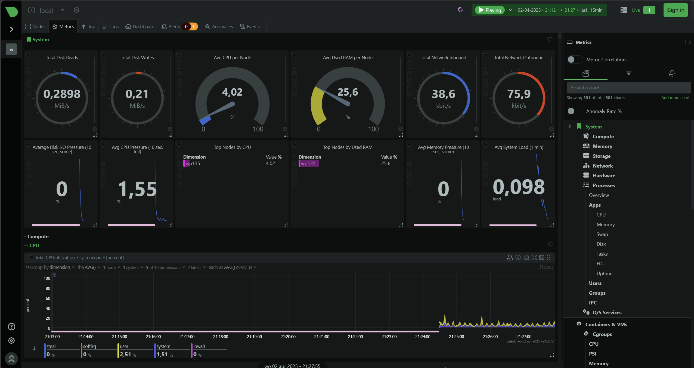

## Verantwoording Opdracht 1: Klant 2

### Gedane stappen in Bash:

#### Basisinstellingen

# === Instellingen ===

```bash
beheerder@pve02:~$ # === Instellingen ===
VMID=200
VMNAME="wpcrm"
CEPHPOOL="vm-storage"
DISK="${CEPHPOOL}:vm-${VMID}-disk-0"
CLOUDIMG_URL="https://cloud-images.ubuntu.com/jammy/current/jammy-server-cloudimg-amd64.img"
IMG_RAW="ubuntu.raw"
CLOUDIMG="jammy-server-cloudimg-amd64.img"
MEM=2048
CORES=2
IP="10.24.13.200/24"
GW="10.24.13.1"
USER="wpadmin"
SSH_PUBKEY_PATH="$HOME/.ssh/id_rsa.pub"
```

## Ubuntu Image op CEPH plaatsen

```
beheerder@pve02:~$ echo "📥 Download Ubuntu Cloud Image"
sudo wget -O $CLOUDIMG $CLOUDIMG_URL
📥 Download Ubuntu Cloud Image
--2025-04-02 19:06:15--  https://cloud-images.ubuntu.com/jammy/current/jammy-server-cloudimg-amd64.img
Resolving cloud-images.ubuntu.com (cloud-images.ubuntu.com)... 185.125.190.37, 185.125.190.40, 2620:2d:4000:1::1a, ...
Connecting to cloud-images.ubuntu.com (cloud-images.ubuntu.com)|185.125.190.37|:443... connected.
HTTP request sent, awaiting response... 200 OK
Length: 668097536 (637M) [application/octet-stream]
Saving to: ‘jammy-server-cloudimg-amd64.img’

jammy-server-cloudimg-amd64.img    100%[================================================================>] 637.15M   107MB/s    in 6.0s    

2025-04-02 19:06:21 (106 MB/s) - ‘jammy-server-cloudimg-amd64.img’ saved [668097536/668097536]

beheerder@pve02:~$ echo "🔄 Converteer naar RAW"
sudo qemu-img convert -f qcow2 -O raw $CLOUDIMG $IMG_RAW
🔄 Converteer naar RAW

beheerder@pve02:~$ echo "🧹 Verwijder bestaande disk als die bestaat (optioneel)"
sudo rbd rm ${DISK} 2>/dev/null
🧹 Verwijder bestaande disk als die bestaat (optioneel)
```


#### Stap 1: Maak een nieuwe VM aan
```bash
beheerder@pve02:~$ echo "🧱 Maak VM aan op Ceph"
sudo qm create $VMID \
  --name $VMNAME \
  --memory $MEM \
  --cores $CORES \
  --net0 virtio,bridge=vmbr0 \
  --scsihw virtio-scsi-pci \
  --ide2 ${CEPHPOOL}:cloudinit \
  --ostype l26
🧱 Maak VM aan op Ceph
ide2: successfully created disk 'vm-storage:vm-200-cloudinit,media=cdrom'

beheerder@pve02:~$ sudo qm set $VMID --scsi0 ${DISK}
update VM 200: -scsi0 vm-storage:vm-200-disk-0

beheerder@pve02:~$ sudo qm set $VMID --boot order=scsi0"
update VM 200: -boot order=scsi0

beheerder@pve02:~$ echo "🔑 Cloud-init configuratie (gebruiker, IP, sleutel)"
sudo qm set $VMID \
  --ciuser $USER \
  --sshkey $SSH_PUBKEY_PATH \
  --ipconfig0 ip=${IP},gw=${GW}
🔑 Cloud-init configuratie (gebruiker, IP, sleutel)
update VM 200: -ciuser wpadmin -ipconfig0 ip=10.24.13.200/24,gw=10.24.13.1 -sshkeys ssh-rsa%20AAAAB3NzaC1yc2EAAAADAQABAAACAQDa96FPab%2FBfhZji%2BzZMkU2thb%2BjUkcupUz6FKECcD7GnknlvcW7fek70H1%2F%2FxP3kOb8CdLSCI0Yg9xHhoCsIfW9JIEI4SToNJyEcSR2FiU9U70Nwtdo0Nu6CL9eYx%2F4WN5VrNFx%2B1EHxh3zwd%2Bx1Yr858tpzYu6ZhjrN83oNjpWedo1%2F7wHteJoFtW2ZQV%2FhEFvCpBzoAkNv9yN5PUi5xE0dVmTllbIQV%2F26IJx3BS09jSiK%2F9jUMrkx662lM15vBw1tUolPM2KMT0gJ6FnYJTRP%2F5K3tA%2Fau6a1nrdZ4%2F6W%2Bah3vc3tUQ6XFudPE%2Bg9Fm4ooSs0MI6%2FxgOKvB6zcGapIaP6C9VPlTzdaxim%2FQdgxImsi4f6ZpdD67AbpYrRvP05vd7Hwy0tEyUF0C%2FxUa5lMWjcjctq2cFYs9bkr4860sarRcmbqFBkmfBKI5yZa2aRwJn70ILzGpy2ZkvWrpq4KbIkBJP%2F9p%2BmWremAyQii1ZUE5nu85pPYHT29Lc1Zd03tmjxnaSmQPh0IHWHccm07LTlOAB5X802m%2FwyjZdmHgMfW2YHXTzGY3o7eBzT8bBo2MtBKUqyXAbj1CfBBPyaOzJIEUDSQX5qHPDaYrfkK8iCJUH%2BT83QeNWH1XPY7b7ubuACzrq2yC7sEbN3XoqZPpLaLOJa8myg0%2FZabVcQ%3D%3D%20beheerder%40pve02%0A
```


#### Stap 2: Voeg de VM toe aan de HA groep
```bash
beheerder@pve02:~$ echo "📡 Voeg toe aan HA"
sudo ha-manager add vm:$VMID
📡 Voeg toe aan HA

# Maak een HA-groep aan genaamd 'wp-ha' met prioriteiten per node
beheerder@pve02:~$ sudo ha-manager groupadd wp-ha --nodes pve00,pve01,pve02
beheerder@pve02:~$ sudo ha-manager groupset wp-ha --nodes pve01:150, pve02:200, pve00:100

# Voeg VM toe aan de HA 
sudo ha-manager add vm:200 --group wp-ha --state started
```

Het lukte me niet goed met CLI, dus uitenidelijk met GUI opgelost.

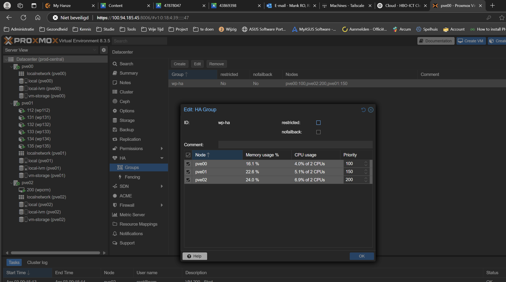


#### Stap 3: Start VM en log in met certificaat zonder wachtwoord
```bash
beheerder@pve02:~$ echo "🚀 Start VM"
sudo qm start $VMID
🚀 Start VM
Requesting HA start for VM 200

beheerder@pve02:~$ ssh wpadmin@10.24.13.200
The authenticity of host '10.24.13.200 (10.24.13.200)' can't be established.
ED25519 key fingerprint is SHA256:VWayaXNhuygFG9i5x60AlC5ggCmUIDdMPHA3nVp7M8k.
This key is not known by any other names.
Are you sure you want to continue connecting (yes/no/[fingerprint])? yes
Warning: Permanently added '10.24.13.200' (ED25519) to the list of known hosts.
Welcome to Ubuntu 22.04.5 LTS (GNU/Linux 5.15.0-135-generic x86_64)

 * Documentation:  https://help.ubuntu.com
 * Management:     https://landscape.canonical.com
 * Support:        https://ubuntu.com/pro

 System information as of Wed Apr  2 17:24:49 UTC 2025

  System load:  0.0               Processes:             98
  Usage of /:   76.7% of 1.96GB   Users logged in:       0
  Memory usage: 10%               IPv4 address for eth0: 10.24.13.200
  Swap usage:   0%


Expanded Security Maintenance for Applications is not enabled.

0 updates can be applied immediately.

Enable ESM Apps to receive additional future security updates.
See https://ubuntu.com/esm or run: sudo pro status

Failed to connect to https://changelogs.ubuntu.com/meta-release-lts. Check your Internet connection or proxy settings


Last login: Wed Apr  2 17:13:25 2025 from 10.24.13.102
To run a command as administrator (user "root"), use "sudo <command>".
See "man sudo_root" for details.

wpadmin@wpcrm:~$ 
```

#### Stap 4: Installeer en configureer WordPress
```bash
sudo apt update && sudo apt upgrade -y
sudo apt install apache2 mariadb-server php php-mysql unzip wget
```

#### Stap 5: DNS server goed instellen

```bash
beheerder@pve02:~$ ssh wpadmin@10.24.13.200 << 'EOF'
echo "nameserver 1.1.1.1" | sudo tee /etc/resolv.conf
EOF
Pseudo-terminal will not be allocated because stdin is not a terminal.
Welcome to Ubuntu 22.04.5 LTS (GNU/Linux 5.15.0-135-generic x86_64)

 * Documentation:  https://help.ubuntu.com
 * Management:     https://landscape.canonical.com
 * Support:        https://ubuntu.com/pro

 System information as of Wed Apr  2 17:37:59 UTC 2025

  System load:  0.0               Processes:             96
  Usage of /:   76.7% of 1.96GB   Users logged in:       0
  Memory usage: 10%               IPv4 address for eth0: 10.24.13.200
  Swap usage:   0%


Expanded Security Maintenance for Applications is not enabled.

0 updates can be applied immediately.

Enable ESM Apps to receive additional future security updates.
See https://ubuntu.com/esm or run: sudo pro status

Failed to connect to https://changelogs.ubuntu.com/meta-release-lts. Check your Internet connection or proxy settings


nameserver 1.1.1.1
```

#### Stap 6 Firewall instellen

```bash
beheerder@pve02:~$ ssh wpadmin@10.24.13.200 << 'EOF'
sudo apt update
sudo apt install -y ufw
sudo ufw default deny incoming
sudo ufw default allow outgoing
sudo ufw allow 22 comment 'Allow SSH'
sudo ufw allow 80 comment 'Allow HTTP'
sudo ufw allow 443 comment 'Allow HTTPS'
sudo ufw --force enable
sudo ufw status verbose
EOF

To                         Action      From
--                         ------      ----
22                         ALLOW IN    Anywhere                   # Allow SSH
80                         ALLOW IN    Anywhere                   # Allow HTTP
443                        ALLOW IN    Anywhere                   # Allow HTTPS
22 (v6)                    ALLOW IN    Anywhere (v6)              # Allow SSH
80 (v6)                    ALLOW IN    Anywhere (v6)              # Allow HTTP
443 (v6)                   ALLOW IN    Anywhere (v6)              # Allow HTTPS
```

#### Stap 7 Vergrootten ruimte

Er bleek niet genoeg ruimte te zijn.

```bash
beheerder@pve02:~$ qm stop 200
-bash: qm: command not found
beheerder@pve02:~$ sudo qm stop 200
Requesting HA stop for VM 200
beheerder@pve02:~$ sudo qm resize 200 scsi0 +10G
Resizing image: 100% complete...done.
beheerder@pve02:~$ sudo qm start 200
Requesting HA start for VM 200
```

#### Stap 8 Update en upgrade

```bash
ssh wpadmin@10.24.13.200 "echo 'nameserver 1.1.1.1' | sudo tee /etc/resolv.conf" # Zeker weten dat DNS goed gaat.

ssh wpadmin@10.24.13.200 << 'EOF'
sudo apt update && sudo apt upgrade -y
EOF
```

#### Installeer Wordpress

uitgevoerde code:

```bash
ssh wpadmin@10.24.13.200 << 'EOF'
# 📦 Vereiste pakketten installeren
sudo apt update
sudo apt install -y apache2 php php-mysql libapache2-mod-php mariadb-server unzip wget

# 🔐 MariaDB beveiligen & database/user aanmaken
sudo mysql -u root <<MYSQL
CREATE DATABASE wordpress;
CREATE USER 'wpuser'@'localhost' IDENTIFIED BY 'wppass';
GRANT ALL PRIVILEGES ON wordpress.* TO 'wpuser'@'localhost';
FLUSH PRIVILEGES;
MYSQL

# 🌐 WordPress downloaden en uitpakken
cd /tmp
wget https://wordpress.org/latest.tar.gz
tar -xvzf latest.tar.gz

# 📁 Verplaatsen naar de juiste map
sudo mv wordpress /var/www/html/
sudo chown -R www-data:www-data /var/www/html/wordpress
sudo chmod -R 755 /var/www/html/wordpress

# ⚙️ Apache configuratie
sudo bash -c 'cat > /etc/apache2/sites-available/wordpress.conf <<CONF
<VirtualHost *:80>
    ServerAdmin admin@localhost
    DocumentRoot /var/www/html/wordpress

    <Directory /var/www/html/wordpress>
        AllowOverride All
        Require all granted
    </Directory>

    ErrorLog \${APACHE_LOG_DIR}/error.log
    CustomLog \${APACHE_LOG_DIR}/access.log combined
</VirtualHost>
CONF'

# 🌐 Apache activeren
sudo a2ensite wordpress.conf
sudo a2enmod rewrite
sudo systemctl reload apache2
EOF

```

Controleslag:

```bash
beheerder@pve02:~$ curl -I http://10.24.13.200/wordpress
HTTP/1.1 301 Moved Permanently
Date: Wed, 02 Apr 2025 18:08:19 GMT
Server: Apache/2.4.52 (Ubuntu)
Location: http://10.24.13.200/wordpress/
Content-Type: text/html; charset=iso-8859-1

beheerder@pve02:~$ curl http://10.24.13.200/wordpress
<!DOCTYPE HTML PUBLIC "-//IETF//DTD HTML 2.0//EN">
<html><head>
<title>301 Moved Permanently</title>
</head><body>
<h1>Moved Permanently</h1>
<p>The document has moved <a href="http://10.24.13.200/wordpress/">here</a>.</p>
<hr>
<address>Apache/2.4.52 (Ubuntu) Server at 10.24.13.200 Port 80</address>
</body></html>
beheerder@pve02:~$ 
```

#### Installeer Tailgate

```bash
beheerder@pve02:~$ echo 'TAILSCALE_AUTH_KEY=....' > /tmp/tailscale.env
beheerder@pve02:~$ # === Config ===
VM_IP="10.24.13.200"
SSH_USER="wpadmin"
TAILSCALE_ENV="/tmp/tailscale.env"
VM_HOSTNAME="wpcrm"
beheerder@pve02:~$ echo "📤 Kopieer Tailscale config naar VM..."
scp $TAILSCALE_ENV ${SSH_USER}@${VM_IP}:/tmp/tailscale.env
📤 Kopieer Tailscale config naar VM...
tailscale.env

beheerder@pve02:~$ # 🚀 Installatie + setup in de VM
ssh ${SSH_USER}@${VM_IP} << 'EOF'
set -e
# 🧪 DNS fix
# 🧪 DNS fixrver 1.1.1.1" | sudo tee /etc/resolv.conf
echo "nameserver 1.1.1.1" | sudo tee /etc/resolv.conf
# 📦 Installatie Tailscale
# 📦 Installatie Tailscale
source /tmp/tailscale.env
sudo apt updatel -y curl jq
sudo apt install -y curl jqe.com/install.sh | sh
curl -fsSL https://tailscale.com/install.sh | sh
sudo systemctl enable --now tailscaled
# ⏳ Wachten op backend
# ⏳ Wachten op backend
for i in {1..10}; dos &>/dev/null; then break; fi
  if tailscale status &>/dev/null; then break; fiep 2
  echo "⏳ Wachten op tailscaled backend..."; sleep 2
done
# 🔐 Verbinden
# 🔐 Verbinden up --authkey "$TAILSCALE_AUTH_KEY" --hostname wpcrm --ssh
sudo tailscale up --authkey "$TAILSCALE_AUTH_KEY" --hostname wpcrm --ssh
# ✅ Status tonen
# ✅ Status tonene IP:"; tailscale ip -4 | head -n 1
echo "🌐 Tailscale IP:"; tailscale ip -4 | head -n 1 ".Self.DNSName"
echo "🔗 DNS naam:"; tailscale status --json | jq -r ".Self.DNSName"
EOF
```
 
Conclusie: Het werkt!
Screenshot van Tailgate en de VM `wpcrm`.
En wordpress raadplegen met tailgate ip in browser.


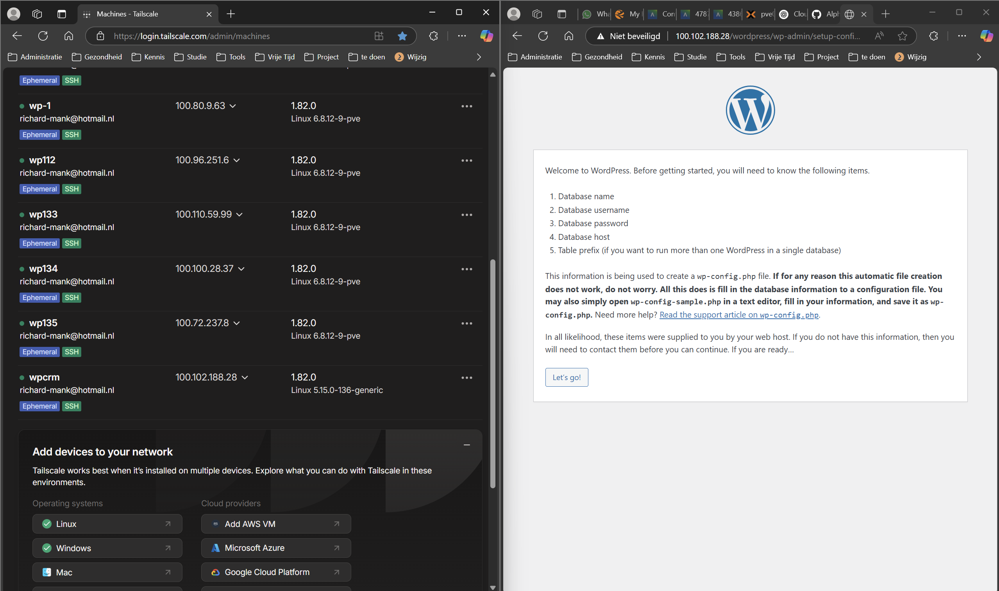

#### Installeer een CRM + wordpress via host
```bash
# zeker weten dat DNS goed staat
ssh wpadmin@10.24.13.200 "echo 'nameserver 1.1.1.1' | sudo tee /etc/resolv.conf"

# WP-CLI installeren
ssh wpadmin@10.24.13.200 << 'EOF'
cd ~
curl -O https://raw.githubusercontent.com/wp-cli/builds/gh-pages/phar/wp-cli.phar
chmod +x wp-cli.phar
sudo mv wp-cli.phar /usr/local/bin/wp
wp --info
EOF

# Maak wp-config.php direct aan via WP-CLI
ssh wpadmin@10.24.13.200 << 'EOF'
cd /var/www/html/wordpress
sudo -u www-data wp config create \
  --dbname=wordpress \
  --dbuser=wpuser \
  --dbpass=wppass \
  --dbhost=localhost \
  --skip-check \
  --force
EOF

# WordPress core installatie (vanaf host)
ssh wpadmin@10.24.13.200 << 'EOF'
cd /var/www/html/wordpress
sudo -u www-data wp core install \
  --url="http://10.24.13.200/wordpress" \
  --title="WPCRM Site" \
  --admin_user=admin \
  --admin_password=adminpass123 \
  --admin_email=admin@example.com
EOF


# CRM installeren Jetpack CRM
ssh wpadmin@10.24.13.200 << 'EOF'
cd /var/www/html/wordpress
wp plugin install zero-bs-crm --activate
EOF
```

#### Wordpress site met CRM

Niet de mooiste site :)
Maar hij werkt wel!

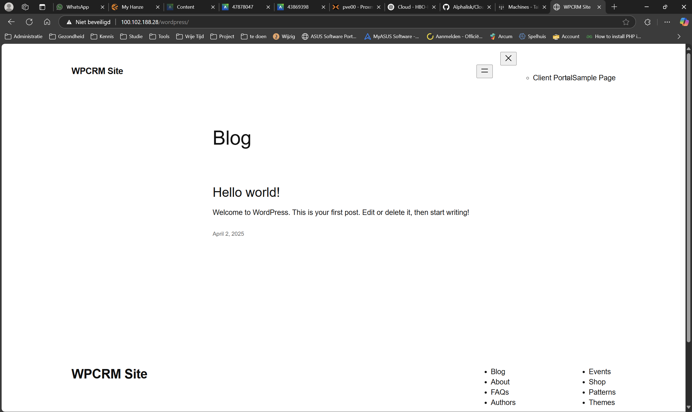

#### Monitoring

Stap 1 - zeker weten dat er geen oude netdata is.
(ik heb een paar keer netdata geinstalleerd die niet werkte.)

```bash
# purge old netdata
ssh wpadmin@10.24.13.200 << 'EOF'
sudo systemctl stop netdata || true
sudo pkill netdata || true
sudo apt purge --yes netdata netdata-core netdata-web netdata-plugins-* || true
sudo rm -rf /etc/netdata /var/lib/netdata /var/cache/netdata /opt/netdata /usr/lib/netdata /usr/sbin/netdata
sudo rm -f /etc/systemd/system/netdata.service
EOF
```

Stap 2: Goede install.

```bash
# clean install
ssh wpadmin@10.24.13.200 << 'EOF'
bash <(curl -SsL https://my-netdata.io/kickstart.sh)
EOF
```

Stap 3: Firewall moet 19999 toelaten van netstat.

```bash
# Firewall (misschien nodig)
sudo ufw allow 19999/tcp comment 'Allow Netdata'
sudo systemctl restart netdata
```

De monitoring van de VM werkt op WPCRM!

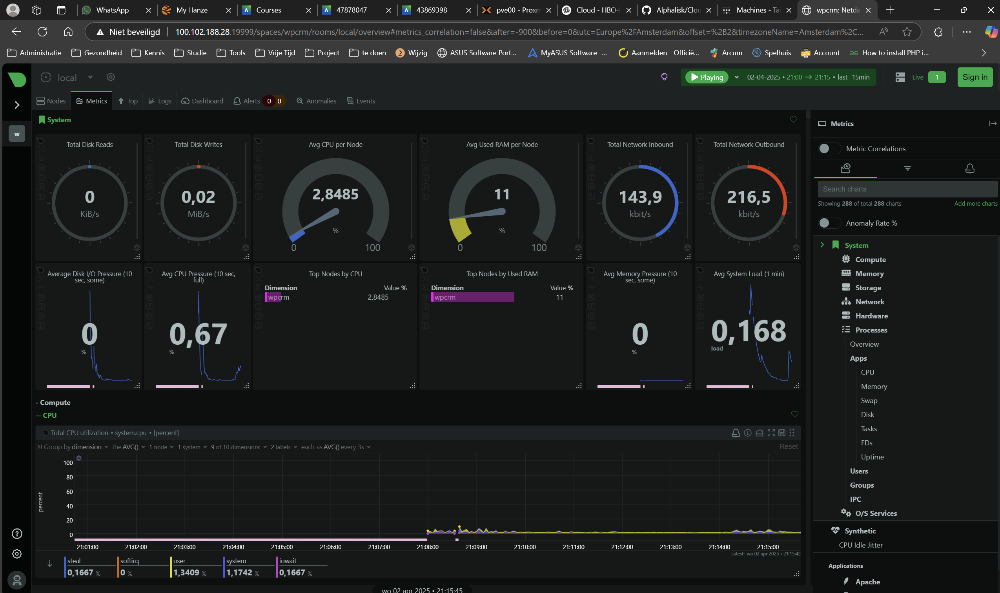

#### Failover test

De VM met HA wordt uitgezet.

```bash
# op terminal 1:
beheerder@pve02:~$ sudo watch -n1 ha-manager status

# op teminal 2, simuleer stroomuitval
sudo systemctl poweroff
```

screenshot:

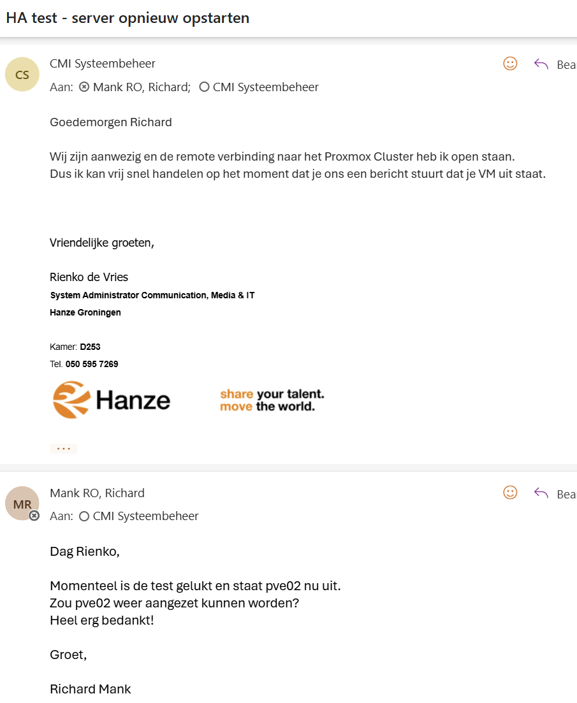

De video van de HA is opgenomen in de video in de bijlage. *(te groot voor github)*


*Gemaakt door: Richard Mank*  
*Studentnummer: 460389*  
*Datum: 2-4-2025*

